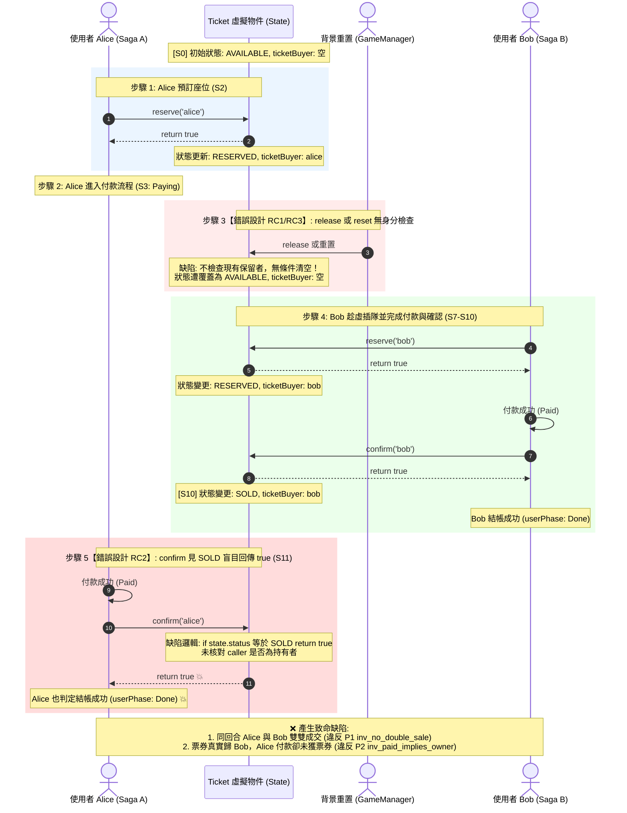
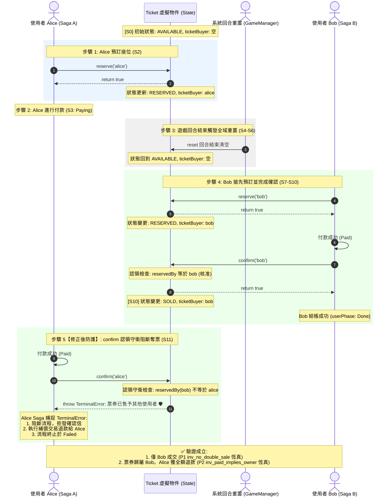

# 本地端重現 Quint 反例與併發競態缺陷指南

本文檔記錄如何在本地端完整重現 [specs/checkoutBuggy.qnt](file:///Users/cfh00805122/lab/playground/restate/restate-cloudflare-workers-poc/specs/checkoutBuggy.qnt) 所發現的競態反例（F1 雙重成交、F2 失去票券），以及對照驗證修復版 [specs/checkout.qnt](file:///Users/cfh00805122/lab/playground/restate/restate-cloudflare-workers-poc/specs/checkout.qnt) 與修復後程式碼的阻斷效果。

---

## 目錄

- [一、背景概述](#一背景概述)
- [二、方法一：Quint 形式化規格檢驗（最推薦、秒級驗證）](#二方法一quint-形式化規格檢驗最推薦秒級驗證)
- [三、方法二：本地 TypeScript 單元測試機械化驗證](#三方法二本地-typescript-單元測試機械化驗證)
- [四、方法三：本地真實 Restate + Wrangler 端到端（E2E）重現](#四方法三本地真實-restate--wrangler-端到端e2e重現)
- [五、修復前後行為對照摘要](#五修復前後行為對照摘要)
- [六、Mermaid 時序圖：Buggy 與 Fixed 併發交錯對照](#六mermaid-時序圖buggy-與-fixed-併發交錯對照)
  - [【圖一：錯誤設計的步驟】（specs/checkoutBuggy.qnt S0–S11 缺陷軌跡）](#圖一錯誤設計的步驟specscheckoutbuggyqnt-s0s11-缺陷軌跡)
  - [【圖二：修正後的步驟】（specs/checkout.qnt 正式規格防護）](#圖二修正後的步驟specscheckoutqnt-正式規格防護)

---

## 一、背景概述

目前線上 Cloudflare Workers（`main` 分支最新部署）已包含認領守衛與阻斷修復。若要在**本地端（Local Environment）**完全不影響線上環境的前提下重現該問題，可以選擇以下三種層級的方法：

1. **規格層面（Quint）**：直接透過模型檢驗器在數學狀態機層面 100% 確定性產出反例路徑（S0–S11 軌跡）。
2. **測試層面（Node.js / TypeScript）**：透過專案內建的 [test/race_counterexample.test.ts](file:///Users/cfh00805122/lab/playground/restate/restate-cloudflare-workers-poc/test/race_counterexample.test.ts) 執行本地機械化斷言。
3. **服務層面（Restate Server + Wrangler Dev）**：在本地啟動 Restate 與 Worker，模擬 Alice 與 Bob 的併發請求重現雙重成交。

---

## 二、方法一：Quint 形式化規格檢驗（最推薦、秒級驗證）

Quint 模型檢驗器直接在本地 Node.js 執行，不需要啟動任何資料庫或 HTTP 伺服器，是最精準且無副作用的重現方式。

### 1. 前置需求
- Node.js >= 18（實測 Node v22.21.1）
- 可存取網路以下載 `@informalsystems/quint@0.32.0`（透過 `npx --yes`，不需更動 `package.json`）

### 2. 重現 Buggy 缺陷（紅燈＝發現反例）

執行以下指令，對 [specs/checkoutBuggy.qnt](file:///Users/cfh00805122/lab/playground/restate/restate-cloudflare-workers-poc/specs/checkoutBuggy.qnt) 進行不變量檢查：

```bash
# 重現 P1（不可雙重成交）違反反例：
npx --yes @informalsystems/quint@0.32.0 run specs/checkoutBuggy.qnt \
  --main checkoutBuggy \
  --invariant=inv_no_double_sale \
  --seed=0x2a
```

#### 預期輸出（Exit Code 1，找到反例軌跡）：
```text
An example execution:
[State 0]  ... (初始 AVAILABLE)
[State 2]  ticketBuyer: "A", ticketStatus: Reserved, userPhase: Map("A" -> Paying, "B" -> Idle)
[State 4]  epoch: 2, ticketBuyer: "", ticketStatus: Available (A 遭重置/未授權釋放)
[State 7]  ticketBuyer: "B", ticketStatus: Reserved, userPhase: Map("A" -> Paying, "B" -> Paying)
[State 10] ticketBuyer: "B", ticketStatus: Sold,     userPhase: Map("A" -> Paid, "B" -> Done)
[State 11] ticketBuyer: "B", ticketStatus: Sold,     userPhase: Map("A" -> Done, "B" -> Done)

[violation] Found an issue (104ms at 10 traces/second).
error: Invariant violated
```
> **現象說明**：在 `State 11`，`userPhase` 顯示 `A` 與 `B` 均進入 `Done`（雙雙收到訂單完成確認），但票券擁有者 `ticketBuyer` 僅為 `"B"`。A 付了款卻未獲得票券，嚴重違反 `inv_no_double_sale` 與 `inv_paid_implies_owner`。

### 3. 對照驗證修復版（綠燈＝通過驗證）

執行修復後的正式規格 [specs/checkout.qnt](file:///Users/cfh00805122/lab/playground/restate/restate-cloudflare-workers-poc/specs/checkout.qnt)：

```bash
npx --yes @informalsystems/quint@0.32.0 run specs/checkout.qnt \
  --main checkout \
  --invariant=inv_no_double_sale \
  --seed=0x2a
```

#### 預期輸出（Exit Code 0）：
```text
[ok] No violation found (51ms at 20 traces/second).
```

---

## 三、方法二：本地 TypeScript 單元測試機械化驗證

專案中已經實作了一支專門驗證此反例軌跡的測試套件：[test/race_counterexample.test.ts](file:///Users/cfh00805122/lab/playground/restate/restate-cloudflare-workers-poc/test/race_counterexample.test.ts)。

### 1. 執行修復後阻斷測試（驗證防護有效）

在專案根目錄執行：

```bash
npm run test:race
```

#### 預期輸出：
```text
▶ Quint 反例機械化驗證（specs/checkoutBuggy.qnt S0-S11 軌跡）
  ✔ S0-S11 物件狀態機交錯：A 遭 reset/插隊後，A 的 confirm 必須被拒絕，杜絕雙重成交
  ✔ Checkout Saga 端到端驗證：A 付款中途票被搶購，A 的結帳流程必須失敗並補償，不可回傳成功
✔ Quint 反例機械化驗證（specs/checkoutBuggy.qnt S0-S11 軌跡）
ℹ pass 2
ℹ fail 0
```

### 2. 本地驗證修復前的失敗情境（重現缺陷紅燈）

若要觀察修復前的程式碼如何導致測試紅燈：
1. 暫時將 [src/game.ts](file:///Users/cfh00805122/lab/playground/restate/restate-cloudflare-workers-poc/src/game.ts) 的 `confirm` 方法改為歷史 Buggy 邏輯：
   ```typescript
   // 暫時修改 src/game.ts 中的 confirm
   if (state.status === "SOLD") {
     return true; // 缺陷：不檢查 caller，直接 return true
   }
   ```
2. 再次執行 `npm run test:race`：
   - 測試會立即失敗（`AssertionError: rejects promise was resolved with true`）。
   - 證實未修復前的程式碼確實會發生雙重成交。
3. 還原變更：
   ```bash
   git checkout src/game.ts
   ```

---

## 四、方法三：本地真實 Restate + Wrangler 端到端（E2E）重現

若希望啟動真實的本地 Restate Server 與 Cloudflare Worker，發送真實的 HTTP 請求來重現：

### 步驟 1：啟動本地 Restate Server
使用 Docker 啟動本地 Restate 實例：
```bash
docker run --name restate_dev -p 8080:8080 -p 9070:9070 -p 9071:9071 --rm -d docker.io/restatedev/restate:latest
```

### 步驟 2：切換至歷史缺陷版本程式碼（可選）
如欲觀察舊版缺陷，可將 `src/` 檢出至 `checkoutBuggy` tag：
```bash
git checkout checkoutBuggy -- src/
```

### 步驟 3：啟動本地 Worker
啟動本地 Wrangler 開發伺服器（監聽 8787 連接埠）：
```bash
npm run dev
```

### 步驟 4：將本地 Worker 註冊到 Restate Server
因為 Restate 運行在 Docker 容器內，容器需要連向主機（Mac），因此端點位址需指定為 `http://host.docker.internal:8787`；同時 Wrangler 本地僅支援 HTTP/1.1，需加上 `--use-http1.1`：
```bash
npx @restatedev/restate deployments register http://host.docker.internal:8787 --use-http1.1 -y
```

> 💡 **排錯備註**：
> - 若使用 `http://localhost:8787`，Restate 容器會嘗試連線容器內部，導致 `Connection refused (os error 111)`。
> - 若未加 `--use-http1.1`，Restate 預設以 HTTP/2 握手，會遭遇 `META0014 error: server possibly supports only HTTP1.1`。


### 步驟 5：依序發送請求重現交錯（S0–S11 流程）

```bash
SEAT="local-race-test-seat"

# 1. 使用者 Alice 預約座位（State S2）
curl -X POST "http://localhost:8080/Ticket/$SEAT/reserve" \
  -H "Content-Type: application/json" -d '"alice"'
# 回傳: true，票狀態為 RESERVED(alice)

# 2. 模擬背景非同步重置或非本人 release 介入（State S4）
curl -X POST "http://localhost:8080/Ticket/$SEAT/release" \
  -H "Content-Type: application/json" -d '"bob"'

# 3. 使用者 Bob 插隊預約並完成結帳（State S7~S10）
curl -X POST "http://localhost:8080/Ticket/$SEAT/reserve" \
  -H "Content-Type: application/json" -d '"bob"'
curl -X POST "http://localhost:8080/Ticket/$SEAT/confirm" \
  -H "Content-Type: application/json" -d '"bob"'
# 回傳: true，票狀態變成 SOLD(bob)

# 4. 關鍵重現點：Alice 付款完成後呼叫 confirm（State S11）
curl -X POST "http://localhost:8080/Ticket/$SEAT/confirm" \
  -H "Content-Type: application/json" -d '"alice"'
```

#### 結果對比：
- **Buggy 版本（`checkoutBuggy`）**：
  回傳 `true` 💥！Alice 與 Bob 同時認為成交，發生雙重成交。
- **修復後版本（`main`）**：
  回傳 HTTP 500 / Restate TerminalError：
  `Ticket already sold to another user: bob`，成功阻斷！

### 步驟 6：測試完成後還原環境
```bash
# 還原原始碼
git checkout HEAD -- src/

# 停止本地 Restate 容器
docker stop restate_dev
```

---

## 五、修復前後行為對照摘要

| 檢查項目 | 修復前（Buggy 缺陷版本） | 修復後（現行 main / 正式規格） |
|---|---|---|
| **Quint 模型檢驗** | `checkoutBuggy.qnt` 於 Seed `0x2a` 找到反例（Exit 1） | `checkout.qnt` 於各 Seed 均無反例（Exit 0） |
| **`Ticket.confirm` 行為** | 見 `SOLD` 盲目回傳 `true`，不認領呼叫者身分 | 比對 `state.reservedBy === userId`，非本人拋出 `TerminalError` |
| **`Ticket.release` 行為** | 任何 caller 皆可將票強制釋放回 `AVAILABLE` | 僅有票券當前預訂者本人（或系統特定授權）可釋放 |
| **本機自動化測試** | `npm run test:race` 會因缺乏阻斷而失敗 | `npm run test:race` 兩個案例全數通過（Pass 2） |

---

## 六、Mermaid 時序圖：Buggy 與 Fixed 併發交錯對照

為了讓併發競態與防護機制一目瞭然，以下將「**錯誤設計的步驟**」與「**修正後的步驟**」拆分為上下兩張獨立的時序圖。

---

### 【圖一：錯誤設計的步驟】（specs/checkoutBuggy.qnt S0–S11 缺陷軌跡）

此圖完整展示修復前程式碼因缺少身分檢查與認領守衛，如何導致雙重成交與奪票：



---

### 【圖二：修正後的步驟】（specs/checkout.qnt 正式規格防護）

此圖展示修復後（現行 `main` 分支與正式規格）在遭遇相同並發插隊時，如何透過**認領守衛（Caller Guard）**成功阻斷錯誤並啟動補償：




